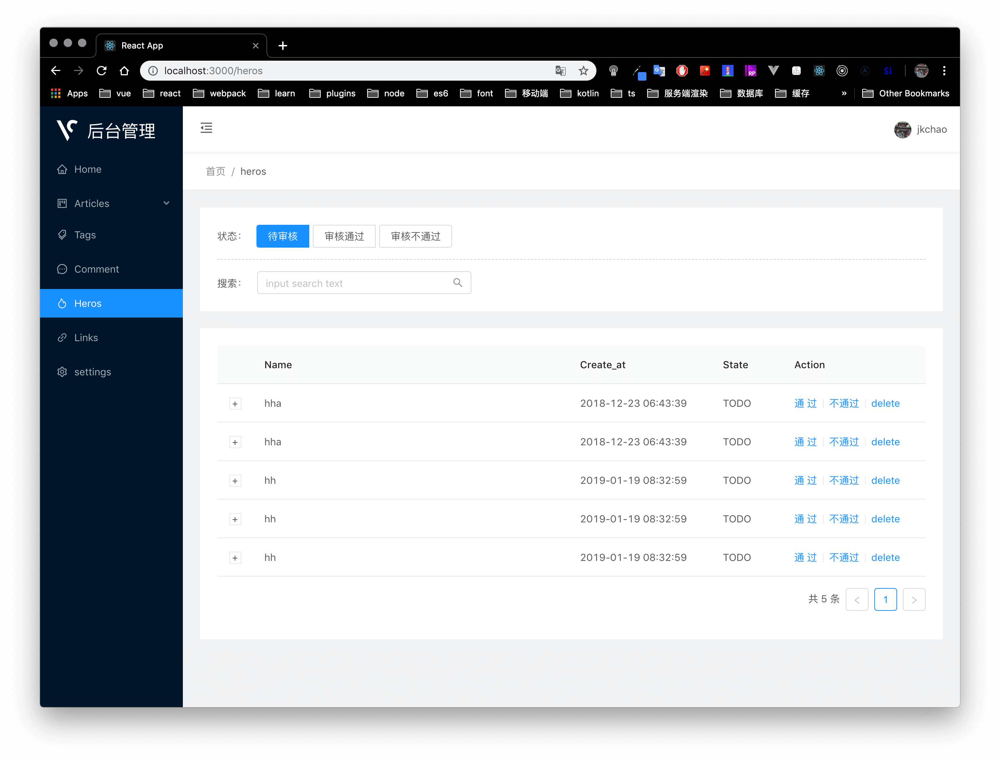
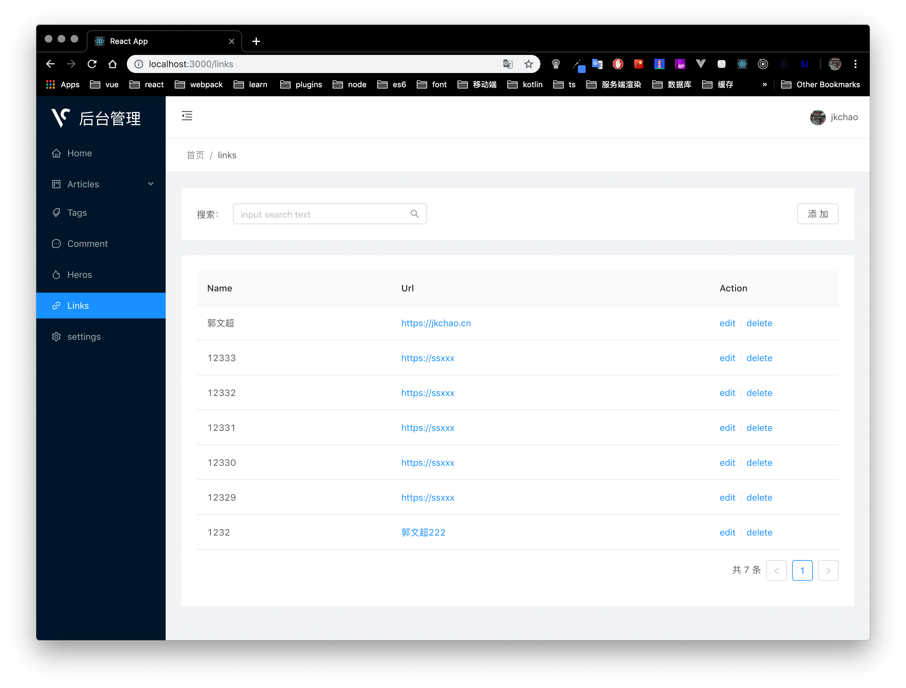
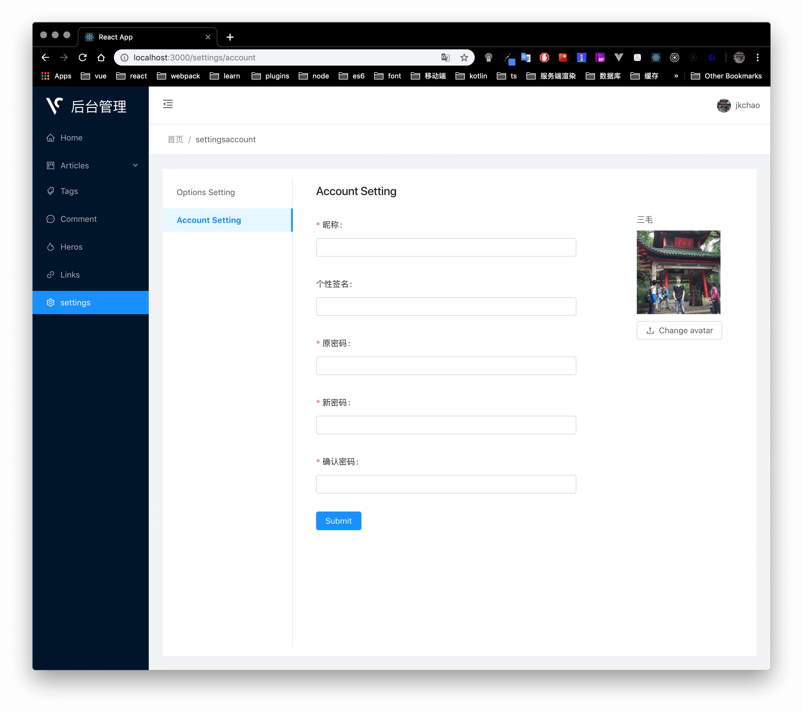

# blog-admin

Vue 版本可查看 [master 分支](https://github.com/jkchao/blog-admin/tree/master)。

使用 React + TypeScript + React-Apollo 重构中...

如果你想启动这个项目，需要先启动后端接口，[blog-service](https://github.com/jkchao/blog-service) 的 nest 分支，关于 service 的具体启动方式，请看 [blog-service](https://github.com/jkchao/blog-service) 的 README.md 部分。

## screenshot






## install

```bash

npm install

npm run dev
```
